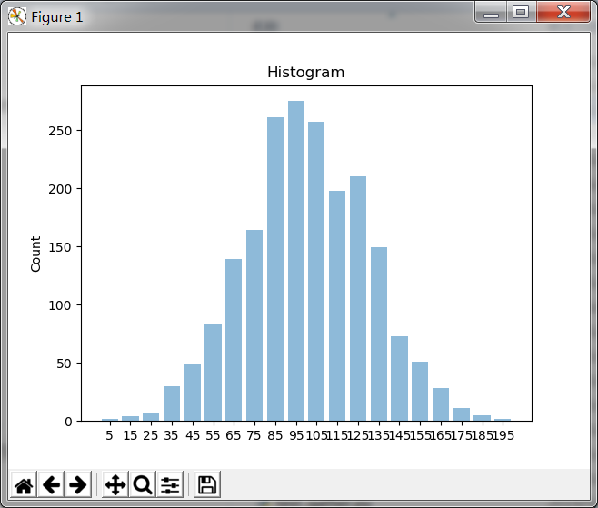

# ThrustRTC - Demo

## Thrust now available to Python!

This is not dreaming. With ThrustRTC, now you have almost all functions of Thrust directly available from Python!

Users are reluctant to use their GPUs sometimes, not because of that they don't like the high-performance, 
but because of that there's no easy way to write GPU programmes in a launguage other than C++. 
With Thrust, many tasks (like sorting, reduction) have become very easy to do. However, a C++ developing environment
plus CUDA SDK is still mandatory. Imagine that we have some data, and we want to do some simple statistical analysis,
we may think, well, this is just some simple work, let's just do it with Python, why bothering opening an IDE and
mess with the compilers etc..

Now with ThrustRTC, the story could change. The following 2 examples will show you how ThrustRTC can be used to do some
simple data anlaysis works using GPU. We could have done the same routines using Thrust in C++, but ThrustRTC makes it
happening in Python. You don't even need a full CUDA SDK to do these.

## Histogram

First, we pretend we have some data to analysis. We use *np.random.randn()* to generate some random numbers:

```python
h_data = np.random.randn(2000).astype(np.float32) * 30.0 +100.0
```

Second, we copy these data to GPU memory by creating a *DVVector* object:

```python
ctx = trtc.Context()
d_data = trtc.device_vector_from_numpy(ctx, h_data)
```

To build a histogram, we first sort the data, so elements of similar values are brought together:

```python
trtc.Sort(ctx, d_data)
```

The cumulative number of elements can be calculated by doing a binary-search of the upper-bounds of each bin of the histogram.
First, we can construct a Fake-Vector of the upper-bounds using a combination of *DVCounter* and *DVTransform*:

```python
d_counter = trtc.DVCounter(ctx, trtc.DVFloat(0.0), 21)
d_range_ends = trtc.DVTransform(ctx, d_counter, "float", 
    trtc.Functor(ctx, {}, ['x'], '        return x*10.0;\n' ))
```

Now *d_range_ends* has 21 elements 0, 10, 20.. 200.

Calculate the cumulative histogram using binary-search:

```python
d_cumulative_histogram =  trtc.device_vector(ctx, "int32_t", 21)
trtc.Upper_Bound_V(ctx, d_data, d_range_ends, d_cumulative_histogram)
```

The final histogram we need can be calculated by doing an adjacent-difference to the cumulative histogram:

```python
d_histogram = trtc.device_vector(ctx, "int32_t", 21)
trtc.Adjacent_Difference(ctx, d_cumulative_histogram, d_histogram)
```

Finally, we copy the result to host-memory and plot it:

```python
h_histogram = d_histogram.to_host(1, 21)

x_axis = [str(x) for x in np.arange(5, 200, 10)]
positions = np.arange(len(x_axis))
plt.bar(positions, h_histogram, align='center', alpha=0.5)
plt.xticks(positions, x_axis)
plt.ylabel('Count')
plt.title('Histogram')

plt.show()
```



The full source-code of demo is available in the repo:

[https://github.com/fynv/ThrustRTC/blob/master/python/demo/histogram.py](https://github.com/fynv/ThrustRTC/blob/master/python/demo/histogram.py)

## K-Means

This shows how to cluster some 2D data-points using K-Means.

First, we generate 2 arrays of random number as the X and Y coordinates of each point:

```python
h_x = np.random.rand(1000).astype(np.float32)*1000.0
h_y = np.random.rand(1000).astype(np.float32)*1000.0
```

Copy these data to GPU Memroy:

```python
ctx = trtc.Context()
d_x = trtc.device_vector_from_numpy(ctx, h_x)
d_y = trtc.device_vector_from_numpy(ctx, h_y)
```

We create a zipped vector combining x and y, data points can be accessed in pairs later on.

```python
d_points = trtc.DVZipped(ctx, [d_x, d_y], ['x','y'])
```

Create some point operators that will be used later:

```python
    point_plus = trtc.Functor(ctx, { }, ['pos1', "pos2"],
'''
        return decltype(pos1)({pos1.x + pos2.x, pos1.y + pos2.y});
''')

    point_div = trtc.Functor(ctx, { }, ['pos', "count"],
'''
        return decltype(pos)({pos.x/(float)count, pos.y/(float)count});
''')
```

The first step of K-Means clustering is to initialize the centers of each group. Here we choose
to use the "Max-min distance measure" for the initialization. That is, using the first element
as the center of the first group, then choose the succeeding centers one by one, also picking 
the element that has the biggest distance to the nearest center that has been choosen:

```python
n = d_x.size()

center_ids = [0] * k
d_min_dis = trtc.device_vector(ctx, "float", n)

for i in range(1, k):
    d_count = trtc.DVInt32(i)
    d_center_ids =  trtc.device_vector_from_list(ctx, center_ids[0:i], 'int32_t')
    calc_min_dis = trtc.Functor(ctx, {"points": d_points, "center_ids": d_center_ids, "count": d_count }, ['pos'], 
'''
        float minDis = FLT_MAX;
        for (int i=0; i<count; i++)
        {
            int j = center_ids[i];
            float dis = (pos.x - points[j].x)*(pos.x - points[j].x);
            dis+= (pos.y - points[j].y)*(pos.y - points[j].y);
            if (dis<minDis) minDis = dis;
        }
        return minDis;
''')
    trtc.Transform(ctx, d_points, d_min_dis, calc_min_dis)
    center_ids[i] = trtc.Max_Element(ctx, d_min_dis)

d_count = trtc.DVInt32(k)
d_center_ids =  trtc.device_vector_from_list(ctx, center_ids, 'int32_t')
```

Create a pair of Vectors each containing k elements, to store the coordinates of group centers,
then *Gather()* their initial values using the input points and the center ids we caculated in
the previous step:

```python
d_group_aves_x =  trtc.device_vector(ctx, "float", k)
d_group_aves_y =  trtc.device_vector(ctx, "float", k)
d_group_aves = trtc.DVZipped(ctx, [d_group_aves_x, d_group_aves_y], ['x','y'])

trtc.Gather(ctx, d_center_ids, d_points, d_group_aves)
```

Create all the buffers before doing the iterations:

```python
# initialize labels
d_labels =  trtc.device_vector(ctx, "int32_t", n)
trtc.Fill(ctx, d_labels, trtc.DVInt32(-1))

# buffer for new-calculated lables
d_labels_new =  trtc.device_vector(ctx, "int32_t", n)

d_labels_sink = trtc.DVDiscard(ctx, "int32_t", k)
d_group_sums = trtc.device_vector(ctx, d_points.name_elem_cls(), k)
d_group_cumulate_counts = trtc.device_vector(ctx, "int32_t", k)
d_group_counts = trtc.device_vector(ctx, "int32_t", k)

d_counter = trtc.DVCounter(ctx, trtc.DVInt32(0), k)
```

We then do the iterations. In each iteration, we do the following:

* Find a new label for each data point according to which group center it is closest to. 
* Check if all the new labels equal to the old labels, if so, break to loop.
* Caculate the new centers of each group by:
  * Sorting the data points by their labels, so the points of the same group are brought together
  * Calculate the sum of point coordinates by Reduce_By_Key()
  * Using binary-search and adjacent-difference to get the number of points of clustered to each group
  * Divide the sum of coordinates by the number of points

```python
while True:
    # calculate new labels
    calc_new_labels = trtc.Functor(ctx, {"aves": d_group_aves, "count": d_count }, ['pos'], 
'''
        float minDis = FLT_MAX;
        int label = -1;
        for (int i=0; i<count; i++)
        {
            float dis = (pos.x - aves[i].x)*(pos.x - aves[i].x);
            dis+= (pos.y - aves[i].y)*(pos.y - aves[i].y);
            if (dis<minDis) 
            {
                minDis = dis;
                label = i;
            }
        }
        return label;
''')
    trtc.Transform(ctx, d_points, d_labels_new, calc_new_labels)
    if trtc.Equal(ctx, d_labels, d_labels_new):
        break
    trtc.Copy(ctx, d_labels_new, d_labels)

    # recalculate group-average values
    trtc.Sort_By_Key(ctx, d_labels, d_points)
    trtc.Reduce_By_Key(ctx, d_labels, d_points, d_labels_sink, d_group_sums, trtc.EqualTo(), point_plus)
    trtc.Upper_Bound_V(ctx, d_labels, d_counter, d_group_cumulate_counts)
    trtc.Adjacent_Difference(ctx, d_group_cumulate_counts, d_group_counts)
    trtc.Transform_Binary(ctx, d_group_sums, d_group_counts, d_group_aves, point_div)
```

Finally, copy back all the results that we are interested in and plot them:

```python
h_x = d_x.to_host()
h_y = d_y.to_host()
h_labels = d_labels.to_host()
h_group_aves_x = d_group_aves_x.to_host()
h_group_aves_y = d_group_aves_y.to_host()
h_group_counts = d_group_counts.to_host()

lines = []

for i in range(n):
    label = h_labels[i]
    lines.append([(h_x[i], h_y[i]), (h_group_aves_x[label], h_group_aves_y[label]) ] )

lc = mc.LineCollection(lines)

fig, ax = plt.subplots()
ax.set_xlim((0, 1000))
ax.set_ylim((0, 1000))

ax.add_collection(lc)

plt.show()
```


The full source-code of demo is available in the repo:

[https://github.com/fynv/ThrustRTC/blob/master/python/demo/k-means.py](https://github.com/fynv/ThrustRTC/blob/master/python/demo/k-means.py)


