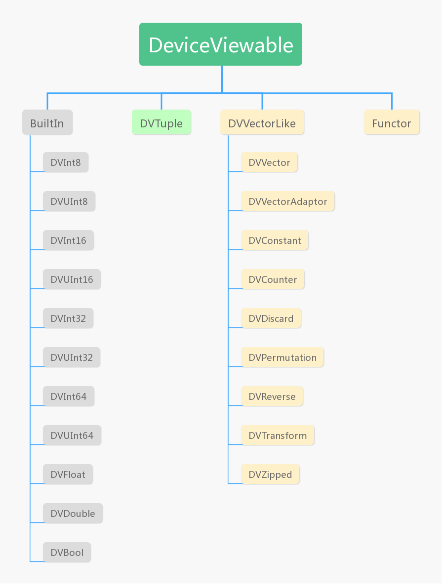

# ThrustRTC - Quick Start Guide

There could be a long time before ThrustRTC can be "properly" documented, with every API covered. That is not the aim of this document.

ThrustRTC is "multilingual". There is a C++ library at its core, a wrapper layer for Python users, a wrapper layer for C# users, and there will be a wrapper layers for Java users as well in the future. Therefore, documenting every detail will be a huge effort. However, thanks to [Thrust](https://thrust.github.io/doc/index.html), most of the core logics of the algorithms are already explained. Algorithm interfaces of ThrustRTC are following very similar logics as Thrust's, so we can focus more on the differences here, which is mostly about the infrastructures.

## Introduction

The project ThrustRTC is trying to provide a basic GPU algorithm library that can be used everywhere. 

Most C/C++ libraries are already able to be used "everywhere", as long as the targeting language has a C/C++ interfacing machinism. However, templated libraries are exceptions, they are C++ only. For GPU programming, it is well known that static-polymorphism is preferred over dynamic-polymorphism. Thrust is a CUDA algorithm library that implemented static-polymorphism based on C++ templates. As a downside, it restricted itself to C++. This project tries to overcome this downside of Thrust using NVRTC, through which "static-polymorphism" of GPU programmes can happen at the runtime of the host program.

ThrustRTC provides almost the same algorithms as Thrust, such as scan, sort and reduce, while making these algorithms available to non-C++ launguages.

### Installation

#### Install from Source Code

Source code of ThrustRTC is available at:

[https://github.com/fynv/ThrustRTC](https://github.com/fynv/ThrustRTC)

The code does not actually contain any CUDA device code that need to be prebuilt, therefore CUDA SDK is not a requirement at building time.

At build time, you will only need:

* UnQLite source code, as submodule: thirdparty/unqlite
* CMake 3.x
* C libraries of Python 3 is required to build the Python binding part of the code.

After cloning the repo from github and resolving the submodules, you can build it with CMake:

```
$ mkdir build
$ cd build
$ cmake .. -DCMAKE_INSTALL_PREFIX=../install
$ make
$ make install
```

You will get the library headers, binaries and examples in the "install" directory.

If you don't have Python installed and you don't need the Python part, you can simply remove the line:
```
add_subdirectory(python)
```
from CMakeLists.txt in the root folder.

You can build the C# wrapping layer in the folder "CSharp" after the C++ library is built.

#### Install ThrustRTC for Python from Pypi

Experimental builds for Win64/Linux64 + Python 3.7 are available from [Pypi](https://pypi.org/project/ThrustRTC/)
If your environment matches, you can try:

```
$ pip3 install ThrustRTC
```

You will not get the C++ library, headers as well as all the test programs using this installation method.

#### GitHub Release

Zip packages are available at:

[https://github.com/fynv/ThrustRTC/releases](https://github.com/fynv/ThrustRTC/releases)


### Runtime Dependencies

* CUDA driver (up-to-date)
* Shared library of NVRTC 
  
  * Windows: nvrtc64\*.dll, default location: %CUDA_PATH%/bin
  * Linux: libnvrtc.so, default location: /usr/local/cuda/lib64
  
  If the library is not at the default location, you need to call:

  * set_libnvrtc_path() from C++ or 
  * ThrustRTC.set_libnvrtc_path() from Python
  * TRTC.set_libnvrtc_path() from C#

  at run-time to specify the path of the library.

For Python
* Python 3
* numpy
* numba (optional)

## Context and General Kernel Launching

ThrustRTC is based on a special running context built upon NVRTC and NVIDIA graphics driver. 
There was actually a "Context" object. However, after a refactoring, it is now hidden behind the API as a global singleton.

There are still global functions to modify the one and the only one context. The context will evolve as the program runs. 
Headers and global constants can be added to the context, loaded kerenels will be cached. When user submits a kernel that 
is already loaded in the context, it will be used directly and will not be compiled and loaded again.

The following of this sections will talk about how to write and launch your own kernels using this context. 
If you are only interested in using the built-in algorithms, you can skip them an go ahead from [Device Viewable Objects](#device-viewable-objects).

### Kernel Objects

A Kernel object can be created given the following:

* Names of parameters
* Body of the kernel function represented as a string 

Then it can be launched given the following:

* Grid Dimensions
* Block Dimensions
* Device Viewable Objects as arguments

Example using Kernel objects:

```cpp
// C++
#include <stdio.h>
#include "TRTCContext.h"
#include "DVVector.h"

int main()
{
	TRTC_Kernel ker(
	{ "arr_in", "arr_out", "k" },
	"    size_t idx = blockIdx.x * blockDim.x + threadIdx.x;\n"
	"    if (idx >= arr_in.size()) return;\n"
	"    arr_out[idx] = arr_in[idx]*k;\n");

	float test_f[5] = { 1.0f, 2.0f, 3.0f, 4.0f, 5.0 };
	DVVector dvec_in_f("float", 5, test_f);
	DVVector dvec_out_f("float", 5);
	DVFloat k1(10.0);
	const DeviceViewable* args_f[] = { &dvec_in_f, &dvec_out_f, &k1 };
	ker.launch( { 1, 1, 1 }, { 128, 1, 1 }, args_f);
	dvec_out_f.to_host(test_f);
	printf("%f %f %f %f %f\n", test_f[0], test_f[1], test_f[2], test_f[3], test_f[4]);

	return 0;
}
```

```python
# Python
import ThrustRTC as trtc

kernel = trtc.Kernel(['arr_in', 'arr_out', 'k'],
	'''
	size_t idx = blockIdx.x * blockDim.x + threadIdx.x;
	if (idx >= arr_in.size()) return;
	arr_out[idx] = arr_in[idx]*k;
	''')

dvec_in = trtc.device_vector_from_list([ 1.0, 2.0, 3.0, 4.0, 5.0 ], 'float')
dvec_out = trtc.device_vector('float', 5)
dv_k = trtc.DVFloat(10.0)

kernel.launch( 1,128, [dvec_in, dvec_out, dv_k])
print (dvec_out.to_host())
```

### For-Loop Objects

For-Loop is a simplified version of Kernel, specialized for 1D-cases.

A For-Loop object can be created given the following:

* Names of parameters
* Name of the iterator variable 
* Body of the for loop represented as a string 

Then it can be launched given the following:

* An iteration range specified by a begin/end pair, or just "n"
* Device Viewable Objects as arguments

Example using For-Loop objects:

```cpp
// C++
#include <stdio.h>
#include "TRTCContext.h"
#include "DVVector.h"

int main()
{
	TRTC_For f({ "arr_in", "arr_out", "k" }, "idx",
		"    arr_out[idx] = arr_in[idx]*k;\n");

	float test_f[5] = { 1.0f, 2.0f, 3.0f, 4.0f, 5.0 };
	DVVector dvec_in_f("float", 5, test_f);
	DVVector dvec_out_f("float", 5);
	DVDouble k1(10.0);
	const DeviceViewable* args_f[] = { &dvec_in_f, &dvec_out_f, &k1 };
	f.launch_n(5, args_f);
	dvec_out_f.to_host(test_f);
	printf("%f %f %f %f %f\n", test_f[0], test_f[1], test_f[2], test_f[3], test_f[4]);

	return 0;
}
```

```python
# Python
import ThrustRTC as trtc
import numpy as np

forLoop = trtc.For(['arr_in','arr_out','k'], "idx",
	'''
	arr_out[idx] = arr_in[idx]*k;
	''')

dvec_in = trtc.device_vector_from_list( [ 1.0, 2.0, 3.0, 4.0, 5.0 ], 'float')
dvec_out = trtc.device_vector( 'float', 5)
dv_k = trtc.DVFloat(10.0)

forLoop.launch_n( 5, [dvec_in, dvec_out, dv_k])

print (dvec_out.to_host())
```

## Device Viewable Objects

Device Viewable Objects are objects that can be used as kernel arguments. All Device Viewable objects are derived from the class DeviceViewable. Device Viewable Objects have their own type information maintained internally. Therefore, you see that the kernel and for-loop parameters do not have their types defined explicitly. You can consider that all parameters are "templated", which means their types are decided by the recieved arguments.

### Basic Types

The following types of Device Viewable Objects can be initalized using values of basic types.

| Name of Class | C++ Type            | Creation (C++)     | Creation (Python)       |
| ------------- | ------------------- | ------------------ | ----------------------- |
| DVInt8        | int8_t              | DVInt8 x(42);      | x = trtc.DVInt8(42)     |
| DVUInt8       | uint8_t             | DVUInt8 x(42);     | x = trtc.DVUInt8(42)    |
| DVInt16       | int16_t             | DVInt16 x(42);     | x = trtc.DVInt16(42)    |
| DVUInt16      | uint16_t            | DVUInt16 x(42);    | x = trtc.DVUInt16(42)   | 
| DVInt32       | int32_t             | DVInt32 x(42);     | x = trtc.DVInt32(42)    |
| DVUInt32      | uint32_t            | DVUInt32 x(42);    | x = trtc.DVUInt32(42)   |
| DVInt64       | int64_t             | DVInt64 x(42);     | x = trtc.DVInt64(42)    | 
| DVUInt64      | uint64_t            | DVUInt64 x(42);    | x = trtc.DVUInt64(42)   | 
| DVFloat       | float               | DVFloat x(42.0f);  | x = trtc.DVFloat(42.0)  |
| DVDouble      | double              | DVDouble x(42.0);  | x = trtc.DVDouble(42.0) |
| DVBool        | bool                | DVBool x(true);    | x = trtc.DVBool(True)   |
| DVSizeT       | size_t              | DVSizeT x(42);     | N/A                     |
| DVChar        | char                | DVChar x(42);      | N/A                     |
| DVSChar       | signed char         | DVSChar x(42);     | N/A                     |
| DVUChar       | unsigned char       | DVUChar x(42);     | N/A                     |
| DVShort       | short               | DVShort x(42);     | N/A                     |
| DVUShort      | unsigned short      | DVUShort x(42);    | N/A                     |
| DVInt         | int                 | DVInt x(42);       | N/A                     |
| DVUInt        | unsigned int        | DVUInt x(42);      | N/A                     |
| DVLong        | long                | DVLong x(42);      | N/A                     |
| DVULong       | unsigned long       | DVULong x(42);     | N/A                     |
| DVLongLong    | long long           | DVLongLong x(42);  | N/A                     |
| DVULongLong   | unsigned long long  | DVULongLong x(42); | N/A                     |

### Tuples

Tuples can be created by combining multiple Device Viewable Objects.
Different from Thrust, in ThrustRTC, elements of a Tuple are accessed by their names, not by indices.
The names of elements need to be specified at the creation of Tuples.

```cpp
// C++
DVInt32 d_int(123);
DVFloat d_float(456.0f);
DVTuple d_tuple( { {"a", &d_int}, {"b",&d_float} });
```

```python
# Python
d_int = trtc.DVInt32(123);
d_float = trtc.DVFloat(456.0);
d_tuple = trtc.DVTuple( {'a': d_int, 'b': d_float}
```

### Advanced Types

Besides the basic types and Tuples, Vectors and Functors are also Device Viewable Objects.
These objects will be explained in separated sections.

Hierarchy of Device Viewable Objects



## Vectors

Just like in Thrust, Vector is used as the most important data-container in ThrustRTC.

A difference between ThrustRTC and Thrust is that there are no "iterators" in ThrustRTC.
Vectors are Device Viewable Objects, and algorithms works directly on Vectors.

In Thrust, there are "Fancy Iteractors" like "constant_iterator", "counting_iterator". 
In ThrustRTC, the corresponding functionalities are provided through "Fake Vectors" --
Device Viewable Objects that can be accessed by indices but does not necessarily have
a storage.

### DVVector

#### Creation

In C++ code, a DVVector object can be created given the following:

* Name of the type of elements: it can be anything that CUDA recognizes as a type.
* Number of elements 
* A pointer to a host array as source (optional)

```cpp
// C++
int hIn[8] = { 10, 20, 30, 40, 50, 60, 70, 80 };
DVVector dIn("int32_t", 8, hIn);
DVVector dOut("int32_t", 8);
```

In Python, there are several ways to create a DVVector object.

* Create from Numpy

```python
# Python
harr = np.array([1.0, 2.0, 3.0, 4.0, 5.0], dtype='float32')
darr = trtc.device_vector_from_numpy(harr)
```

The supported Numpy dtypes are:

| Numpy dtype | C++ Type |
| ----------- | -------- |
| np.int8     | int8_t   |
| np.uint8    | uint8_t  |
| np.int16    | int16_t  |
| np.uint16   | uint16_t |
| np.int32    | int32_t  |
| np.uint32   | uint32_t |
| np.int64    | int64_t  |
| np.uint64   | uint64_t |
| np.float32  | float    |
| np.float64  | double   |
| np.bool     | bool     |

* Create from Python List

```python
# Python
dvec_in = trtc.device_vector_from_list([ 1.0, 2.0, 3.0, 4.0, 5.0 ], 'float')
```

The C++ type specified here should be one of the basic types corresponding to a supported Numpy dtype, as listed above.

* Create with Specified Type and Size

```python
# Python
dvec_out = trtc.device_vector('float', 5)
```
In this case, the C++ type specified can be any type that CUDA recognizes.

Optionally, a raw C++ pointer to an host array can be passed as the source to copy from.

#### to_host()

* The method *to_host()* can be used to copy the content of DVVector to host.

The C++ version needs a host buffer of enough size.

```cpp
// C++
int hIn[8] = { 10, 20, 30, 40, 50, 60, 70, 80 };
DVVector dIn("int32_t", 8, hIn);
dIn.to_host(hIn);
```

The Python version returns a Numpy NDArray. The type of elements must be a supported one.

```python
# Python
dvec_in = trtc.device_vector_from_list( [ 1.0, 2.0, 3.0, 4.0, 5.0 ], 'float')
print(dvec_in.to_host())
```

There are optional parameters *begin* and *end* which can be used to specify a range to copy.

### DVVectorAdaptor

DVVectorAdaptor objects are device Vectors with externally managed storage.

In C++ code, user can create a DVVectorAdaptor object just like creating a DVVector, 
passing in pointer of device memory instead of host memory to initialize the object.
The device memory should not be freed while the DVVectorAdaptor object is still being
used.

In Python, DVVectorAdaptor is used by DVNumbaVector to adapt to Numba. A Numba DeviceNDArray
can easily be used as a ThrustRTC recognized Vector like the following code shows:

```python
# Python
import ThrustRTC as trtc
import numpy as np
from numba import cuda

nparr = np.array([1, 0, 2, 2, 1, 3], dtype=np.int32)
nbarr = cuda.to_device(nparr)
darr = trtc.DVNumbaVector(nbarr)
trtc.Inclusive_Scan(darr, darr)
print(nbarr.copy_to_host())
``` 

### DVConstant

DVConstant is corresponding to *thrust::constant_iterator*. 

A DVConstant object can be created using a constant Device Viewable Object and accessed as a Vector of constant value.

```cpp
// C++
#include "TRTCContext.h"
#include "DVVector.h"
#include "fake_vectors/DVConstant.h"
#include "copy.h"

int main()
{
	DVConstant src(DVInt32(123), 10)
	DVVector dst("int32_t", 10);
	TRTC_Copy(src, dst);
	...
}

```

```python
# Python
import ThrustRTC as trtc

src = trtc.DVConstant(trtc.DVInt32(123), 10)
dst = trtc.device_vector('int32_t', 10)
trtc.Copy(src, dst)

```

### DVCounter

DVCounter is corresponding to *thrust::counting_iterator*. 

A DVCounter object can be created using a constant Device Viewable Object as initial value,
and accessed as a Vector of sequentially changing values.

```cpp
// C++
#include "TRTCContext.h"
#include "DVVector.h"
#include "fake_vectors/DVCounter.h"
#include "copy.h"

int main()
{
	DVCounter src(DVInt32(1), 10)
	DVVector dst("int32_t", 10);
	TRTC_Copy(src, dst);
	...
}

```

```python
# Python
import ThrustRTC as trtc

src = trtc.DVCounter(trtc.DVInt32(1), 10)
dst = trtc.device_vector('int32_t', 10)
trtc.Copy(src, dst)

```

### DVDiscard

DVDiscard is corresponding to *thrust::discard_iterator*. 

A DVDiscard can be created given the element type. It will ignore all value written to it. 
Can be used as a place-holder for an unused output.

### DVPermutation

DVPermutation is corresponding to *thrust::permutation_iterator*. 

A DVPermutation object can be created using a Vector as source and another Vector as indices, 
and then accessed the source Vector in permuted order.

```cpp
// C++
#include "TRTCContext.h"
#include "DVVector.h"
#include "fake_vectors/DVPermutation.h"
#include "copy.h"

int main()
{
	float hvalues[8] = { 10.0f, 20.0f, 30.0f, 40.0f, 50.0f, 60.0f, 70.0f, 80.0f };
	DVVector dvalues("float", 8, hvalues);

	int hindices[4] = { 2,6,1,3 };
	DVVector dindices("int32_t", 4, hindices);

	DVPermutation src(dvalues, dindices);
	DVVector dst("float", 4);
	
	TRTC_Copy(src, dst);
	...
}

```

```python
# Python
import ThrustRTC as trtc

dvalues = trtc.device_vector_from_list([10.0, 20.0, 30.0, 40.0, 50.0, 60.0, 70.0, 80.0], 'float')
dindices =  trtc.device_vector_from_list([2,6,1,3], 'int32_t')
src = trtc.DVPermutation(dvalues, dindices)
dst = trtc.device_vector('float', 4)

trtc.Copy(src, dst)

```

### DVReverse

DVReverse is corresponding to *thrust::reverse_iterator*. 

A DVReverse object can be created using a Vector as source and access it in reversed order.

```cpp
// C++
#include "TRTCContext.h"
#include "DVVector.h"
#include "fake_vectors/DVReverse.h"
#include "copy.h"

int main()
{
	int hvalues[4] = { 3, 7, 2, 5 };
	DVVector dvalues("int32_t", 4, hvalues);

	DVReverse src(dvalues);
	DVVector dst("int32_t", 4);
	
	TRTC_Copy(src, dst);
	...
}

```

```python
# Python
import ThrustRTC as trtc

dvalues = trtc.device_vector_from_list([3, 7, 2, 5], 'int32_t')
src = trtc.DVReverse(dvalues)
dst = trtc.device_vector('int32_t', 4)

trtc.Copy(src, dst)

```

### DVTransform

DVTransform is corresponding to *thrust::transform_iterator*. 

A DVTransform object can be created using a Vector as source and a Functor as operator, 
then access the transformed values of the source Vector.


```cpp
// C++
#include "TRTCContext.h"
#include "DVVector.h"
#include "fake_vectors/DVTransform.h"
#include "copy.h"

int main()
{
	float hvalues[8] = { 1.0f, 4.0f, 9.0f, 16.0f };
	DVVector dvalues("float", 4, hvalues);

	Functor square_root{ {}, { "x" }, "        return sqrtf(x);\n" };

	DVTransform src(dvalues, "float", square_root);
	DVVector dst("float", 4);
	
	TRTC_Copy(src, dst);
	...
}

```


```python
# Python
import ThrustRTC as trtc

dvalues = trtc.device_vector_from_list([1.0, 4.0, 9.0, 16.0], 'float')

square_root = trtc.Functor({}, ['x'], 
'''
         return sqrtf(x);
''')

src = trtc.DVTransform(dvalues, 'float', square_root)
dst = trtc.device_vector('float', 4)

trtc.Copy(src, dst)

```

### DVZipped

DVZipped is corresponding to *thrust::zip_iterator*. 

A DVZipped object can be created using multiple Vectors as inputs and accessed as a Vector consisting 
elements combined from the elements from each of these Vectors.

```cpp
// C++
#include "TRTCContext.h"
#include "DVVector.h"
#include "fake_vectors/DVTransform.h"
#include "copy.h"

int main()
{
	int h_int_in[5] = { 0, 1, 2, 3, 4};
	DVVector d_int_in("int32_t", 5, h_int_in);
	float h_float_in[5] = { 0.0f, 10.0f, 20.0f, 30.0f, 40.0f };
	DVVector d_float_in("float", 5, h_float_in);

	DVVector d_int_out("int32_t", 5);
	DVVector d_float_out("float", 5);

	DVZipped src({ &d_int_in, &d_float_in }, { "a", "b" });
	DVZipped dst({ &d_int_out, &d_float_out }, { "a", "b" });

	TRTC_Copy(src, dst);
	...
}

```


```python
# Python
import ThrustRTC as trtc

d_int_in = trtc.device_vector_from_list([0, 1, 2, 3, 4], 'int32_t')
d_float_in = trtc.device_vector_from_list([ 0.0, 10.0, 20.0, 30.0, 40.0], 'float')

d_int_out = trtc.device_vector('int32_t', 5)
d_float_out = trtc.device_vector('float', 5)

src = trtc.DVZipped([d_int_in, d_float_in], ['a','b'])
dst = trtc.DVZipped([d_int_out, d_float_out], ['a','b'])

trtc.Copy(src, dst)

```

### DVCustomVector

DVCustomVector allows user to customize the behavior of a Fake Vector.
It is corresponding to *iterator_adaptor*.

A DVCustomVector object can be created given:

* A map of Device Viewable Object to be captured, usually used as source of data
* Name of the index variable, which is a *size_t* variable used by *operator[]*
* The code-body of *operator[]* represented as a string.
* ELement type of the vector as a string
* Size of the vector
* Optional switch telling if the elements are read-only

```cpp
// C++
#include "TRTCContext.h"
#include "DVVector.h"
#include "fake_vectors/DVCustomVector.h"
#include "copy.h"

int main()
{
	int h_in[5] = { 0, 1, 2, 3, 4};
	DVVector d_in("int32_t", 5, h_in);

	DVCustomVector src({ {"src", &d_in} }, "idx",
	"        return src[idx % src.size()];\n", "int32_t", d_in.size() * 5);

	DVVector dst("int32_t", 25);
	
	TRTC_Copy(src, dst);
}
```

```python
# Python
import ThrustRTC as trtc

d_in = trtc.device_vector_from_list([0, 1, 2, 3, 4], 'int32_t')

src = trtc.DVCustomVector({'src':d_in }, 'idx',
'''
       return src[idx % src.size()]; 
''',  "int32_t", d_in.size() * 5) 

dst = trtc.device_vector('int32_t', 25)

trtc.Copy(src, dst)
```

## Functors

Functors, in generally sense, are objects with an *operator()*. 
In ThrustRTC, Functors are Device Viewable Objects with a device *operator()*.
There are 2 kinds of Functors that can be used: user defined Functors and
built-in Functors.

### User Defined Functors

An user defined functor can be created given:

* A map of Device Viewable Object to be captured, can be empty.
* A list of names of Functor parameters, that are the parameters of *operator()*.
* The code-body of *operator()* represented as a string.

```cpp
// C++
Functor is_even = { {},{ "x" }, "        return x % 2 == 0;\n" };
```

```python
# Python
is_even = trtc.Functor( {}, ['x'], 
'''
         return x % 2 == 0;
''')
```

A temporary structure will be created internally, which looks like:

```cpp
// CUDA C++, internal code 
struct
{
	template<typename T>
	__device__ inline auto operator()(const T& x)
	{
		return x % 2 == 0;
	}
};

```

The indentation is there just to make the code formated nicely so it will be easy to debug
when there is a compilation error.

### Built-In Functors

In C++ code and Python code, the ways to create a built-in Functor are a little different.
In C++, the class Functor has a constructor that takes in a single string parameter.
In Python, Built-In Functors are defined as separate classes.

The following built-in Functors are available:

| Name of Functor | Creation (C++)             | Creation (Python)        |
| --------------- | -------------------------- | ------------------------ |
| Identity        | Functor f("Identity")      | f = trtc.Identity()      |
| Maximum         | Functor f("Maximum")       | f = trtc.Maximum()       |
| Minimum         | Functor f("Minimum")       | f = trtc.Minimum()       |
| EqualTo         | Functor f("EqualTo")       | f = trtc.EqualTo()       |
| NotEqualTo      | Functor f("NotEqualTo")    | f = trtc.NotEqualTo()    |
| Greater         | Functor f("Greater")       | f = trtc.Greater()       |
| Less            | Functor f("Less")          | f = trtc.Less()          |
| GreaterEqual    | Functor f("GreaterEqual")  | f = trtc.GreaterEqual()  | 
| LessEqual       | Functor f("LessEqual")     | f = trtc.LessEqual()     | 
| Plus            | Functor f("Plus")          | f = trtc.Plus()          | 
| Minus           | Functor f("Minus")         | f = trtc.Minus()         | 
| Multiplies      | Functor f("Multiplies")    | f = trtc.Multiplies()    | 
| Divides         | Functor f("Divides")       | f = trtc.Divides()       | 
| Modulus         | Functor f("Modulus")       | f = trtc.Modulus()       | 
| Negate          | Functor f("Negate")        | f = trtc.Negate()        | 


## Algorithms

Each algorithm of ThrustRTC is corresponding to one in Thrust. 
A significant difference between ThrustRTC functions and Thrust functions is that Thrust 
functions takes in iterators as parameters, while ThrustRTC takes in Vectors directly.
In ThrustRTC, the working ranges can be specified separately using *begin*/*end* parameters.
These parameters have default values *begin = 0* and *end = -1* that cover the full range
of the Vectors.

### Transformations

Transformation algorithms are one-pass algorithms applied to each element of one or more Vectors.

The simpliest transformation algorithm is Fill, which sets all elements of a Vector to a specified
value.

```cpp
// C++
DVVector darr("int32_t", 5);
TRTC_Fill(darr, DVInt32(123));
```

```python
# Python
darr = trtc.device_vector('int32_t', 5)
trtc.Fill(darr, trtc.DVInt32(123))
```

The above code sets all elements of the Vector to 123. Other transformations include Sequence,
Replace, and of course Transform.

The following source code demonstrates several of the transformation algorithms.

```cpp
// C++
#include <stdio.h>
#include "TRTCContext.h"
#include "DVVector.h"
#include "transform.h"
#include "sequence.h"
#include "fill.h"
#include "replace.h"

int main()
{
	DVVector X("int32_t", 10);
	DVVector Y("int32_t", 10);
	DVVector Z("int32_t", 10);

	// initialize X to 0,1,2,3, ....
	TRTC_Sequence(X);

	// compute Y = -X
	TRTC_Transform(X, Y, Functor("Negate"));

	// fill Z with twos
	TRTC_Fill(Z, DVInt32(2));

	// compute Y = X mod 2
	TRTC_Transform_Binary(X, Z, Y, Functor("Modulus"));

	// replace all the ones in Y with tens
	TRTC_Replace(Y, DVInt32(1), DVInt32(10));

	// print Y
	int results[10];
	Y.to_host(results);

	for (int i = 0; i < 10; i++)
		printf("%d ", results[i]);
	puts("");

	return 0;
}
```

```python
# Python
import ThrustRTC as trtc

X = trtc.device_vector('int32_t', 10)
Y = trtc.device_vector('int32_t', 10)
Z = trtc.device_vector('int32_t', 10)

# initialize X to 0,1,2,3, ....
trtc.Sequence(X)

# compute Y = -X
trtc.Transform(X, Y, trtc.Negate())

# fill Z with twos
trtc.Fill(Z, trtc.DVInt32(2))

# compute Y = X mod 2
trtc.Transform_Binary(X, Z, Y, trtc.Modulus())

# replace all the ones in Y with tens
trtc.Replace(Y, trtc.DVInt32(1), trtc.DVInt32(10))

# print Y
print(Y.to_host())
```

### Reductions

A reduction algorithm uses a binary operation to reduce an input Vector to a single value. 
For example, the sum of a Vector of numbers is obtained by reducing the array with a Plus
operation. Similarly, the maximum of a Vector is obtained by reducing with a Maximum 
operation. The sum of a Vector D can be done by the following code:

```cpp
// C++
ViewBuf ret;
TRTC_Reduce(D, DVInt32(0), Functor("Plus"), ret);
int sum = *((int*)ret.data());
```

```python
# Python
sum = trtc.Reduce(D, trtc.DVInt32(0), trtc.Plus())
```

The first argument is the input Vector. The second and third arguments provide the initial 
value and reduction operator respectively. Actually, this kind of reduction is so common 
that it is the default choice when no initial value or operator is provided. The following 
three lines are therefore equivalent:

```python
# Python
sum = trtc.Reduce(D, trtc.DVInt32(0), trtc.Plus())
sum = trtc.Reduce(D, trtc.DVInt32(0))
sum = trtc.Reduce(D)
```

Although Reduce() is sufficient to implement a wide variety of reductions, ThrustRTC provides
a few additional functions for convenience. For example, Count() returns the number of 
instances of a specific value in a given Vector.

```python
# Python
vec = trtc.device_vector_from_list([ 0, 1, 0, 1, 1], 'int32_t')
result = trtc.Count(vec, trtc.DVInt32(1))
```

Other reduction operations include Count_If(), Min_Element(), Max_Element(), Is_Sorted(),
Inner_Product(), and several others.

### Prefix-Sums

Parallel prefix-sums, or *scan* operations, are important building blocks in many parallel 
algorithms such as stream compaction and radix sort. Consider the following source code
which illustrates an *inclusive scan* operation using the default **plus** operator:

```cpp
// C++
int data[6] = { 1, 0, 2, 2, 1, 3 };
DVVector d_data("int32_t", 6, data);
TRTC_Inclusive_Scan(d_data, d_data); // in-place scan
d_data.to_host(data);
// data is now {1, 1, 3, 5, 6, 9}
```

```python
# Python
d_data = trtc.device_vector_from_list([1, 0, 2, 2, 1, 3], 'int32_t')
trtc.Inclusive_Scan(d_data, d_data) # in-place scan
#  d_data is now {1, 1, 3, 5, 6, 9}
```
In an inclusive scan each element of the output is the corresponding partial sum of the
input Vector. For example, data[2] = data[0] + data[1] + data[2]. An exclusive
scan is similar, but shifted by one place to the right:

```python
# Python
d_data = trtc.device_vector_from_list([1, 0, 2, 2, 1, 3], 'int32_t')
trtc.Exclusive_Scan(d_data, d_data) # in-place scan
# d_data is now {0, 1, 1, 3, 5, 6}
```

So now data[2] = data[0] + data[1]. As these examples show, Inclusive_Scan()
and Exclusive_Scan() are permitted to be performed in-place. ThrustRTC also provides
the functions Transform_Inclusive_Scan() and Transform_Exclusive_Scan() which
apply a unary function to the input Vector before performing the scan.

### Reordering

ThrustRTC provides support for partitioning and stream compaction through the following
algorithms:

Copy_If(): copy elements that pass a predicate test
Partition(): reorder elements according to a predicate (True values precede False values)
Remove() and Remove_If(): remove elements that pass a predicate test
Unique(): remove consecutive duplicates within a sequence

### Sorting

ThrustRTC offers several functions to sort data or rearrange data according to a given
criterion. All sorting algorithms of ThrustRTC are stable.

```cpp
// C++
int hvalues[6]= { 1, 4, 2, 8, 5, 7 };
DVVector dvalues("int32_t", 6, hvalues);

TRTC_Sort(dvalues);
dvalues.to_host(hvalues);
// hvalues is now {1, 2, 4, 5, 7, 8}
```

```python
# Python
dvalues = trtc.device_vector_from_list([ 1, 4, 2, 8, 5, 7 ], 'int32_t')
trtc.Sort(dvalues)
# dvalues is now {1, 2, 4, 5, 7, 8}
```

In addition, ThrustRTC provides Sort_By_Key(), which sort key-value pairs stored in separate places.

```cpp
// C++
int hkeys[6] = { 1, 4, 2, 8, 5, 7 };
DVVector dkeys("int32_t", 6, hkeys);
char hvalues[6] = { 'a', 'b', 'c', 'd', 'e', 'f' };
DVVector dvalues("int8_t", 6, hvalues);
TRTC_Sort_By_Key(dkeys, dvalues);
dkeys.to_host(hkeys);
dvalues.to_host(hvalues);
// hkeys is now { 1, 2, 4, 5, 7, 8}
// hvalues is now {'a', 'c', 'b', 'e', 'f', 'd'}
```

```python
# Python
dkeys = trtc.device_vector_from_list([ 1, 4, 2, 8, 5, 7 ], 'int32_t')
dvalues = trtc.device_vector_from_list([ 1, 2, 3, 4, 5, 6], 'int32_t')
trtc.Sort_By_Key(dkeys, dvalues)
# dkeys is now { 1, 2, 4, 5, 7, 8}
# dvalues is now {'1', '3', '2', '5', '6', '4'}
```

Just like in Thrust, sorting functions in ThrustRTC also accept functors as alternative 
comparison operators:

```cpp
// C++
int hvalues[6] = { 1, 4, 2, 8, 5, 7 };
DVVector dvalues("int32_t", 6, hvalues);
TRTC_Sort(dvalues, Functor("Greater"));
dvalues.to_host(hvalues);
// hvalues is now {8, 7, 5, 4, 2, 1}
```

```python
# Python
dvalues = trtc.device_vector_from_list([ 1, 4, 2, 8, 5, 7 ], 'int32_t')
trtc.Sort(dvalues, trtc.Greater())
# dvalues is now {8, 7, 5, 4, 2, 1}
```
